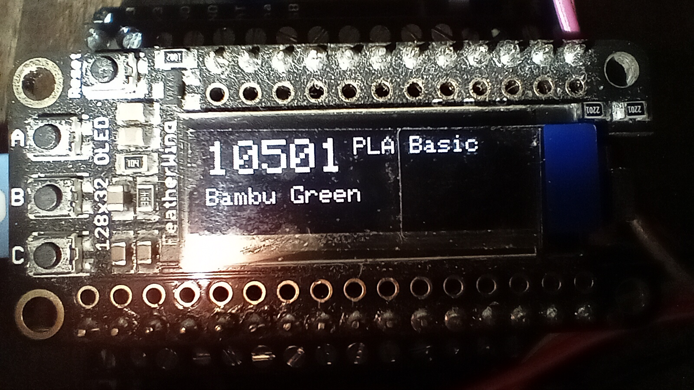

# Bambu RFID Readers

	
	

ESP8266 Feather HUZZAH + RC522 readers that derive Bambu Lab MIFARE Classic sector keys on-device, read spool tags, and decode filament metadata (code, name, color, type, temps, length, production date, tray UID, nozzle, width). 
The filament code is practical if you want to order a new roll of a filament but you've thrown the box away.

Keys are derived with the same HKDF (HMAC-SHA256) as Bambu-Lab-RFID-Library (`RFID-A\0` context, known salt) using the tag UID as IKM, per Bambu-Research-Group/RFID-Tag-Guide.

Variants (both are read-only; no tag writes):
- `RFID_Bambu_lab_reader_OLED/RFID_Bambu_lab_reader_OLED.ino`: Serial + 128x32 SSD1306 OLED ([Adafruit OLED FeatherWing](https://learn.adafruit.com/adafruit-oled-featherwing)); LED flashes for ~150 ms and OLED briefly shows "Read" before the 5-digit filament code/name/color.
- `RFID_Bambu_lab_reader/RFID_Bambu_lab_reader.ino`: Serial-only; LED flash only.

Any Arduino-compatible MCU with SPI (and I2C for OLED) at 3.3V for RC522 should work; pins below are tested on ESP8266 Feather HUZZAH.

## Pin mapping (ESP8266 HUZZAH)

| Signal | ESP8266 pin |
| --- | --- |
| RC522 SS/SDA | 16 (D0) |
| RC522 RST | 2 (D4) |
| RC522 SCK | 14 (D5) |
| RC522 MOSI | 13 (D7) |
| RC522 MISO | 12 (D6) |
| RC522 VCC | 3.3V |
| RC522 GND | GND |
| OLED SDA (OLED variant) | 4 (D2) |
| OLED SCL (OLED variant) | 5 (D1) |
| OLED VCC | 3.3V |
| OLED GND | GND |

## Build & upload
- Install `arduino-cli` (https://arduino.github.io/arduino-cli/latest/installation/) and ensure it is on your PATH (macOS: `brew install arduino-cli`; verify with `arduino-cli version`).
- Install library `MFRC522`; OLED variant also needs `Adafruit_GFX` and `Adafruit_SSD1306`. Board FQBN: `esp8266:esp8266:huzzah`.
- VS Code tasks (see `.vscode/tasks.json`):
	- `arduino: compile (OLED)` → compiles `RFID_Bambu_lab_reader_OLED.ino`.
	- `arduino: compile (serial-only)` → compiles `RFID_Bambu_lab_reader.ino`.
	- `arduino: compile+upload (OLED)` → compiles + uploads OLED variant (set `PORT` in the task or via the input prompt).
	- `arduino: upload (set PORT)` → upload helper.
- CLI examples:
	- `arduino-cli compile --fqbn esp8266:esp8266:huzzah RFID_Bambu_lab_reader_OLED/RFID_Bambu_lab_reader_OLED.ino`
	- `arduino-cli compile --fqbn esp8266:esp8266:huzzah RFID_Bambu_lab_reader/RFID_Bambu_lab_reader.ino`
	- `arduino-cli upload -p /dev/cu.usbserial-<port> --fqbn esp8266:esp8266:huzzah RFID_Bambu_lab_reader_OLED/RFID_Bambu_lab_reader_OLED.ino`

## Filament lookup
`material_lookup.h` (one per sketch folder) contains curated entries followed by the generated list from the Bambu store scraper (wrapping queengooborg/Bambu-Lab-RFID-Library `scrape_filaments.py`). Regenerate with `python scripts/generate_materials.py`:
- Default: writes to `generated/` at repo root, then copy into each sketch's `generated/` folder (already mirrored in this repo). You can also pass a target dir, e.g., `python scripts/generate_materials.py RFID_Bambu_lab_reader/generated`.
- The script reuses any known `variantId`/`materialId` for a filament code from the previous `materials.json`; new colors from the store will have blank IDs (the tags still decode but will show the fallback message if the variant is unknown).
- The sketch includes `generated/materials_snippet.h` after the curated entries. Extend `material_lookup.h` if a variant/material is missing; the sketch prints a fallback when lookup fails.

Full table (variant → code/name/color) as currently generated:

| Variant | Filament Code | Name | Color |
| --- | --- | --- | --- |
| A00-W1 | 10100 | PLA Basic | Jade White |
| A00-P0 | 10201 | PLA Basic | Beige |
| A00-D2 | 10104 | PLA Basic | Light Gray |
| A00-Y0 | 10400 | PLA Basic | Yellow |
| A00-Y2 | 10402 | PLA Basic | Sunflower Yellow |
| A00-A1 | 10301 | PLA Basic | Pumpkin Orange |
| A00-A0 | 10300 | PLA Basic | Orange |
| A00-Y4 | 10401 | PLA Basic | Gold |
| A00-G3 | 10503 | PLA Basic | Bright Green |
| A00-G1/G6 | 10501 | PLA Basic | Bambu Green |
| A00-G2 | 10502 | PLA Basic | Mistletoe Green |
| A00-A0 | 10203 | PLA Basic | Pink |
| A00-R3 | 10204 | PLA Basic | Hot Pink |
| A00-P6 | 10202 | PLA Basic | Magenta |
| A00-R0 | 10200 | PLA Basic | Red |
| A00-R2 | 10205 | PLA Basic | Maroon Red |
| A00-P5 | 10700 | PLA Basic | Purple |
| A00-P2 | 10701 | PLA Basic | Indigo Purple |
| A00-B5 | 10605 | PLA Basic | Turquoise |
| A00-B8 | 10603 | PLA Basic | Cyan |
| A00-B3 | 10604 | PLA Basic | Cobalt Blue |
| A09-B4 | 10601 | PLA Basic | Blue |
| A00-N0 | 10800 | PLA Basic | Brown |
| A00-N1 | 10802 | PLA Basic | Cocoa Brown |
| A00-Y3 | 10801 | PLA Basic | Bronze |
| A00-D0 | 10103 | PLA Basic | Gray |
| A00-D1 | 10102 | PLA Basic | Silver |
| A00-B1 | 10602 | PLA Basic | Blue Grey |
| A00-D3 | 10105 | PLA Basic | Dark Gray |
| A00-K0 | 10101 | PLA Basic | Black |
| A18-K0 | 16100 | PLA Lite | Black |
| A18-D0 | 16101 | PLA Lite | Gray |
| A18-W0 | 16103 | PLA Lite | White |
| A18-R0 | 16200 | PLA Lite | Red |
| A18-Y0 | 16400 | PLA Lite | Yellow |
| A18-B0 | 16600 | PLA Lite | Cyan |
| A18-B1 | 16601 | PLA Lite | Blue |
| A18-P0 | 16602 | PLA Lite | Matte Beige |
| A01-W2 | 11100 | PLA Matte | Ivory White |
| A01-W3 | 11103 | PLA Matte | Bone White |
| A01-Y2 | 11400 | PLA Matte | Lemon Yellow |
| A01-A2 | 11300 | PLA Matte | Mandarin Orange |
| A01-P3 | 11201 | PLA Matte | Sakura Pink |
| A01-P4 | 11700 | PLA Matte | Lilac Purple |
| A01-R3 | 11204 | PLA Matte | Plum |
| A01-R1 | 11200 | PLA Matte | Scarlet Red |
| A01-R4 | 11202 | PLA Matte | Dark Red |
| A01-G0 | 11502 | PLA Matte | Apple Green |
| A01-G1 | 11500 | PLA Matte | Grass Green |
| A01-G7 | 11501 | PLA Matte | Dark Green |
| A01-B4 | 11601 | PLA Matte | Ice Blue |
| A01-B0 | 11603 | PLA Matte | Sky Blue |
| A01-B3 | 11600 | PLA Matte | Marine Blue |
| A01-B6 | 11602 | PLA Matte | Dark Blue |
| A01-Y3 | 11401 | PLA Matte | Desert Tan |
| A01-N1 | 11800 | PLA Matte | Latte Brown |
| A01-N3 | 11803 | PLA Matte | Caramel |
| A01-R2 | 11203 | PLA Matte | Terracotta |
| A01-N2 | 11801 | PLA Matte | Dark Brown |
| A01-N0 | 11802 | PLA Matte | Dark Chocolate |
| A01-D3 | 11102 | PLA Matte | Ash Gray |
| A01-D0 | 11104 | PLA Matte | Nardo Gray |
| A01-K1 | 11101 | PLA Matte | Charcoal |
| A00-M3 | 10903 | PLA Basic Gradient | Pink Citrus |
| A00-M6 | 10906 | PLA Basic Gradient | Dusk Glare |
| A00-M0 | 10900 | PLA Basic Gradient | Arctic Whisper |
| A00-M1 | 10901 | PLA Basic Gradient | Solar Breeze |
| A00-M5 | 10905 | PLA Basic Gradient | Blueberry Bubblegum |
| A00-M4 | 10904 | PLA Basic Gradient | Mint Lime |
| A00-M2 | 10902 | PLA Basic Gradient | Ocean to Meadow |
| A00-M7 | 10907 | PLA Basic Gradient | Cotton Candy Cloud |
| A12-G0 | 15500 | PLA Glow | Green |
| A12-R0 | 15200 | PLA Glow | Pink |
| A12-A0 | 15300 | PLA Glow | Orange |
| A12-Y0 | 15400 | PLA Glow | Yellow |
| A12-B0 | 15600 | PLA Glow | Blue |
| A07-R5 | 13201 | PLA Marble | Red Granite |
| A07-D4 | 13103 | PLA Marble | White Marble |
| A11-W0 | 14102 | PLA Aero | White |
| A11-K0 | 14103 | PLA Aero | Black |
| A08-G3 | 13501 | PLA Sparkle | Alpine Green Sparkle |
| A08-D5 | 13102 | PLA Sparkle | Slate Gray Sparkle |
| A08-B7 | 13700 | PLA Sparkle | Royal Purple Sparkle |
| A08-R2 | 13200 | PLA Sparkle | Crimson Red Sparkle |
| A08-K2 | 13101 | PLA Sparkle | Onyx Black Sparkle |
| A08-Y1 | 13402 | PLA Sparkle | Classic Gold Sparkle |
| A02-B2 | 13600 | PLA Metal | Cobalt Blue Metallic |
| A02-G2 | 13500 | PLA Metal | Oxide Green Metallic |
| A02-Y1 | 13400 | PLA Metal | Iridium Gold Metallic |
| A02-D2 | 13100 | PLA Metal | Iron Gray Metallic |
| A17-B1 | 13611 | PLA Translucent | Blue |
| A17-A0 | 13301 | PLA Translucent | Orange |
| A17-P0 | 13710 | PLA Translucent | Purple |
| A17-G0 | 13510 | PLA Translucent | Light Jade |
| A17-Y0 | 13410 | PLA Translucent | Mellow Yellow |
| A17-R1 | 13211 | PLA Translucent | Cherry Pink |
| A06-Y1 | 13405 | PLA Silk+ | Gold |
| A06-D0 | 13108 | PLA Silk+ | Titan Gray |
| A06-D1 | 13109 | PLA Silk+ | Silver |
| A06-W0 | 13110 | PLA Silk+ | White |
| A06-R0 | 13205 | PLA Silk+ | Candy Red |
| A06-G0 | 13506 | PLA Silk+ | Candy Green |
| A06-G1 | 13507 | PLA Silk+ | Mint |
| A06-B1 | 13604 | PLA Silk+ | Blue |
| A06-B0 | 13603 | PLA Silk+ | Baby Blue |
| A06-P0 | 13702 | PLA Silk+ | Purple |
| A06-R1 | 13206 | PLA Silk+ | Rose Gold |
| A06-R2 | 13207 | PLA Silk+ | Pink |
| A06-Y0 | 13404 | PLA Silk+ | Champagne |
| A05-M8 | 13912 | PLA Silk Multi-Color | Dawn Radiance |
| A05-M4 | 13909 | PLA Silk Multi-Color | Aurora Purple |
| A05-M1 | 13906 | PLA Silk Multi-Color | South Beach |
| A05-T3 | 13903 | PLA Silk Multi-Color | Neon City |
| A05-T2 | 13902 | PLA Silk Multi-Color | Midnight Blaze |
| A05-T1 | 13901 | PLA Silk Multi-Color | Gilded Rose |
| A05-T4 | 13904 | PLA Silk Multi-Color | Blue Hawaii |
| A05-T5 | 13905 | PLA Silk Multi-Color | Velvet Eclipse |
| A15-B0 | 13602 | PLA Galaxy | Purple |
| A15-G0 | 13503 | PLA Galaxy | Green |
| A15-G1 | 13504 | PLA Galaxy | Nebulae |
| A15-R0 | 13203 | PLA Galaxy | Brown |
| A16-K0 | 13107 | PLA Wood | Black Walnut |
| A16-R0 | 13204 | PLA Wood | Rosewood |
| A16-N0 | 13801 | PLA Wood | Clay Brown |
| A16-G0 | 13505 | PLA Wood | Classic Birch |
| A16-W0 | 13106 | PLA Wood | White Oak |
| A16-Y0 | 13403 | PLA Wood | Ochre Yellow |
| A50-D6 | 14101 | PLA-CF | Lava Gray |
| A50-K0 | 14100 | PLA-CF | Black |
| A50-B6 | 14601 | PLA-CF | Royal Blue |
| A10-K0 | 12104 | PLA Tough+ | Black |
| A10-W0 | 12107 | PLA Tough+ | White |
| A10-D0 | 12105 | PLA Tough+ | Gray |
| A09-B5 | 12005 | PLA Tough | Lavender Blue |
| A09-B4 | 12004 | PLA Tough | Light Blue |
| A09-A0 | 12002 | PLA Tough | Orange |
| A09-D1 | 12001 | PLA Tough | Silver |
| A09-R3 | 12003 | PLA Tough | Vermilion Red |
| A09-Y0 | 12000 | PLA Tough | Yellow |
| G02-K0 | 33102 | PETG HF | Black |
| G02-W0 | 33100 | PETG HF | White |
| G02-R0 | 33200 | PETG HF | Red |
| G02-D0 | 33101 | PETG HF | Gray |
| G02-D1 | 33103 | PETG HF | Dark Gray |
| G02-Y1 | 33401 | PETG HF | Cream |
| G02-Y0 | 33400 | PETG HF | Yellow |
| G02-A0 | 33300 | PETG HF | Orange |
| G02-N1 | 33801 | PETG HF | Peanut Brown |
| G02-G1 | 33501 | PETG HF | Lime Green |
| G02-G0 | 33500 | PETG HF | Green |
| G02-G2 | 33502 | PETG HF | Forest Green |
| G02-B1 | 33601 | PETG HF | Lake Blue |
| G02-B0 | 33600 | PETG HF | Blue |
| G01-G1 | 32501 | PETG Translucent | Translucent Teal |
| G01-B0 | 32600 | PETG Translucent | Translucent Light Blue |
| G01-C0 | 32101 | PETG Translucent | Clear |
| G01-D0 | 32100 | PETG Translucent | Translucent Gray |
| G01-G0 | 32500 | PETG Translucent | Translucent Olive |
| G01-N0 | 32800 | PETG Translucent | Translucent Brown |
| G01-A0 | 32300 | PETG Translucent | Translucent Orange |
| G01-P1 | 32200 | PETG Translucent | Translucent Pink |
| G01-P0 | 32700 | PETG Translucent | Translucent Purple |
| G50-G7 | 31500 | PETG-CF | Malachite Green |
| G50-P7 | 31700 | PETG-CF | Violet Purple |
| G50-K0 | 31100 | PETG-CF | Black |
| B00-D1 | 40102 | ABS | Silver |
| B00-K0 | 40101 | ABS | Black |
| B00-W0 | 40100 | ABS | White |
| B00-G6 | 40500 | ABS | Bambu Green |
| B00-G7 | 40502 | ABS | Olive |
| B00-Y1 | 40402 | ABS | Tangerine Yellow |
| B00-A0 | 40300 | ABS | Orange |
| B00-R0 | 40200 | ABS | Red |
| B00-B4 | 40601 | ABS | Azure |
| B00-B0 | 40600 | ABS | Blue |
| B00-B6 | 40602 | ABS | Navy Blue |
| B50-A0 | 41300 | ABS-GF | Orange |
| B50-G0 | 41500 | ABS-GF | Green |
| B50-R0 | 41200 | ABS-GF | Red |
| B50-W0 | 41100 | ABS-GF | White |
| B50-K0 | 41101 | ABS-GF | Black |
| B01-W0 | 45100 | ASA | White |
| B01-K0 | 45101 | ASA | Black |
| B01-D0 | 45102 | ASA | Gray |
| B01-R0 | 45200 | ASA | Red |
| B02-W0 | 46100 | ASA Aero | White |
| C00-C1 | 60103 | PC | Transparent |
| C00-C0 | 60102 | PC | Clear Black |
| C00-K0 | 60101 | PC | Black |
| C00-W0 | 60100 | PC | White |
| C01-K0 | 63100 | PC FR | Black |
| C01-W0 | 63101 | PC FR | White |
| C01-D0 | 63102 | PC FR | Gray |
| U02-B0 | 53600 | TPU for AMS | Blue |
| U02-D0 | 53102 | TPU for AMS | Gray |
| U02-K0 | 53101 | TPU for AMS | Black |
| N04-K0 | 70100 | PAHT-CF | Black |
| N08-K0 | 72104 | PA6-GF | Black |
| S05-C0 | 65103 | Support for PLA/PETG | Black |
| S02-W1 | 65104 | Support for PLA (New Version) | White |
| S06-W0 | 66100 | Support for ABS | White |
| S03-G1 | 65500 | Support for PA/PET | Green |
| S04-Y0 | 66400 | PVA | Clear |

### Missing variant IDs (needs tag scans)
The store listing lacks `variantId` for these codes; scanning a real tag and sharing the variant would fill the gap.
queengooborg collects these in Bambu-Lab-RFID-Library—please share scans or PRs via the contributing section: https://github.com/queengooborg/Bambu-Lab-RFID-Library/tree/main?tab=readme-ov-file#contributing

| Filament Code | Material | Color |
| --- | --- | --- |
| 41600 | ABS-GF | Blue |
| 41102 | ABS-GF | Gray |
| 41400 | ABS-GF | Yellow |
| 45600 | ASA | Blue |
| 45500 | ASA | Green |
| 46101 | ASA-CF | Black |
| 72600 | PA6-GF | Blue |
| 72800 | PA6-GF | Brown |
| 72103 | PA6-GF | Gray |
| 72500 | PA6-GF | Lime |
| 72200 | PA6-GF | Orange |
| 72102 | PA6-GF | White |
| 72400 | PA6-GF | Yellow |
| 31200 | PETG-CF | Brick Red |
| 31600 | PETG-CF | Indigo Blue |
| 31101 | PETG-CF | Titan Gray |
| 14104 | PLA Aero | Gray |
| 13800 | PLA Metal | Copper Brown Metallic |
| 13913 | PLA Silk Multi-Color | Mystic Magenta |
| 13916 | PLA Silk Multi-Color | Phantom Blue |
| 12601 | PLA Tough+ | Cyan |
| 12301 | PLA Tough+ | Orange |
| 12106 | PLA Tough+ | Silver |
| 12401 | PLA Tough+ | Yellow |
| 13610 | PLA Translucent | Ice Blue |
| 13711 | PLA Translucent | Lavender |
| 13210 | PLA Translucent | Red |
| 13612 | PLA Translucent | Teal |
| 14200 | PLA-CF | Burgundy Red |
| 14700 | PLA-CF | Iris Purple |
| 14600 | PLA-CF | Jeans Blue |
| 14500 | PLA-CF | Matcha Green |
| 65102 | Support for PLA/PETG | Nature |
| 53500 | TPU for AMS | Neon Green |
| 53200 | TPU for AMS | Red |
| 53100 | TPU for AMS | White |
| 53400 | TPU for AMS | Yellow |

## References
- Bambu-Lab-RFID-Library: https://github.com/queengooborg/Bambu-Lab-RFID-Library
- Bambu-Research-Group/RFID-Tag-Guide: https://github.com/Bambu-Research-Group/RFID-Tag-Guide
- RC522 library: https://github.com/miguelbalboa/rfid
- Adafruit SSD1306: https://github.com/adafruit/Adafruit_SSD1306
- ESP8266 core for Arduino: https://github.com/esp8266/Arduino
